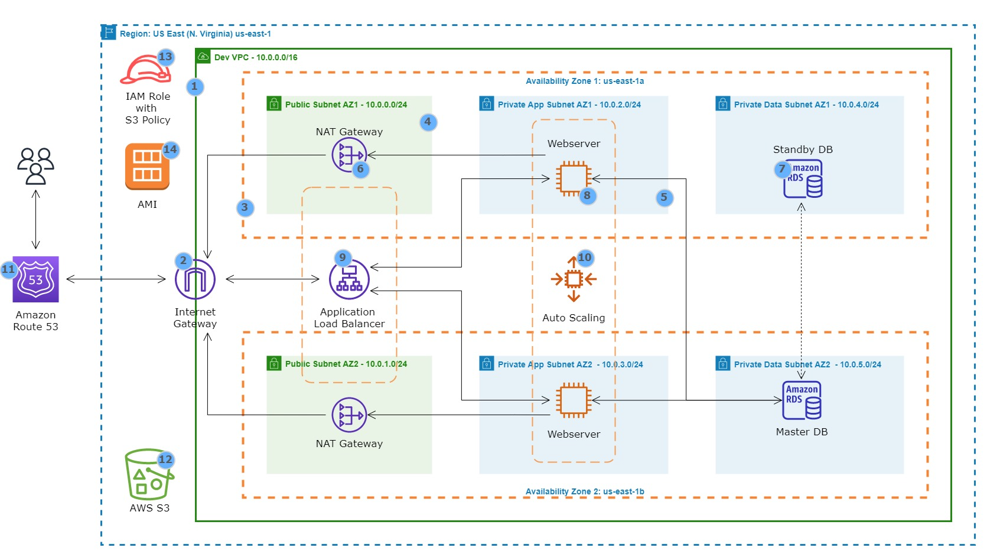

# Deploy-a-Dynamic-Website-on-AWS

This project made me realize how Ecommerce websites/apps such as Amazon, Shopify, and eBay work in the background. What I love most during my journey is I failed several times but because I already have a solid understanding of how these AWS core services work and being a proactive problem solver, I was able to troubleshoot and rebuild everything from the ground up.

This also helped me understand how encryption in transit happens. How to secure the communication between the web browser and the domain name.

Oh yes, I got FRUSTRATED whenever the results didn't turn out as I expected but it felt great when I resolved it.

## Objectives

1. Create VPC with Public and Private Subnets
2. Create NAT Gateways in the Public Subnets
3. Create the Security Groups
4. Create the RDS Instance
5. Create S3 Buckets
6. Create an IAM Role with S3 Policy
7. Deploy an eCommerce Website
8. Import the Dummy Data for the Website
9. Create an Amazon Machine Image(AMI)
10. Create an Application Load Balancer
11. Register a New Domain Name in Route 53
12. Create a Record Set in Route 53
13. Register for an SSL Certificate in AWS Certificate Manager
14. Create an HTTPS Listener
15. SSH into an EC2 Instance in the Private Subnets
16. Update the ENV file
17. Create Another AMI
18. Create an Auto Scaling Group
19. Clean up

### Reference Architecture

  

1. VPC with public and private subnets in 2 availability zones.
2. An internet gateway is used to allow communication between instances in VPC and the internet.
3. We are using 2 availability zones for high availability and fault tolerance.
4. Resources such as NAT gateway, bastion host, and application load balancer uses public subnets
5. We will put the web servers and database servers in the private subnets to protect them
6. The NAT gateway allows the instances in the private app subnets and private data subnets to access the internet
7. We are using MySQL RDS database
8. We are using EC2 instances to host our website
9. Application load balancer is used to distribute web traffic across an auto-scaling group of EC2 instances in multiple AZs
10. Using the auto-scaling group to dynamically create our EC2 instances to make our website highly available, scalable, fault-tolerant, and elastic
11. We are using route 53 to register our domain name and create a record set
12. We are using AWS S3 to store our web files
13. We will use the IAM role to give EC2 permission to download web files from AWS S3
14. Once we have installed our website on an EC2 instance, we will use the EC2 instance we installed our website on to create an AMI
    

